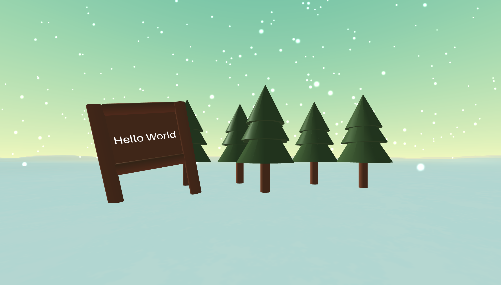

# A-frame demo for Big Mini Conf!

This was created during our time as a student at Code Chrysalis.

## About this demo

I had a TechTalk using this demos, please check it out! [Big Mini Conf Track A](https://www.youtube.com/watch?v=doq3p1wKBvo&t=6033s)

And you can see my demo [here](https://masumomo.github.io/mini-conf-webvr-demo/)


## How to run

ALl HTML file can run locally. But error appears on console.log due to cross-origin policy.
If you want to avoid thi error message, you have to run on local server.

If you can use python, you can use

```
python -m SimpleHTTPServer 8000
```

## How to create this VR demo

If you want to know more, please check TechTalk!

### step1: Import library

We are going to create new html file, and import A-frame library in our HTML file. The result is this file: s1.html.

```
<html>
 <head>
   <script src="https://aframe.io/releases/0.8.0/aframe.min.js"></script>
 </head>
 <body>
 </body>
</html>
```

### step2: Create trees

I'm going to create tree by using 3 cones and a cylinder. The result is this file: s2-1.html.

```
  <body>
   <a-scene>
     <a-cone
        color="#416132" height="0.8" segments-height="0" segments-radial="15"
        radius-bottom="0.4" radius-top="0.001">
     </a-cone>
     <!-- Add more cones and add a cylinder here! -->
   </a-scene>
 </body>
```

And add more! The result is this file: s2-2.html.

```
  <body>
   <a-scene>
       <a-entity class="small-tree">...</a-entity>
       <a-entity class="small-tree" position="0.3 0 -1.2">...</a-entity>
       <a-entity class="small-tree" position="1.3 0 -0.6">...</a-entity>
       ...More trees
   </a-scene>
 </body>

```

### step3: Set up camera

I'm going to set up a camera so that we can see trees without moving perspective. The result is this file: s3.html.

```
  <body>
   <a-scene>
     <a-entity camera position="0 1.4 5"></a-entity>
       <a-entity class="small-tree" position="0.3 0 -1.2">...</a-entity>
       <a-entity class="small-tree" position="1.3 0 -0.6">...</a-entity>
       <a-entity class="small-tree" position="-1 0 -0.4">...</a-entity>
       ...More trees
   </a-scene>
 </body>
```

### step4: Set up a visually interesting environment

I'm going to create interesting environment by using awesome library! The result is this file: s4-1.html.

```
<html>
 <head>
   <script src="https://aframe.io/releases/0.8.0/aframe.min.js"></script>
   <script
src="https://unpkg.com/aframe-environment-component@2.0.0/dist/aframe-environment-component.min.js"></script>
 </head>
  <body>
    <a-entity
        environment="
        preset: forest;
        grid: none;
        ground: hills;groundTexture: walkernoise;
        groundColor:#ffffff;groundColor2:#f5feff;
        dressing:none;"
      ></a-entity>
    ...A-frame scene
</body>
</html>
```

But, all components we created are buried. So, I'm going to change those components position. The result is this file: s4-2.html.

```
  <body>
    <a-entity
        environment="
        preset: forest;
        ..."
      ></a-entity>
      <a-entity class="whole-scene" position="0 1.5 0">
    ...A-frame scene
      </a-entity>
</body>
```

### step5: Create a signboard

I'm going to create a signboard. The result is this file: s5.html.

```
  <a-scene>
      ...
      <a-cylinder
         rotation="0 0 90"
         radius="0.1"
         height="1"
         position="0 0.43 0"
         depth="0.1"
         color="#8D4126"
      ></a-cylinder>
      <a-box...><a-text
          ...
          value="Hello World"
          ...
        ></a-text>
    </a-box>
   </a-scene>
```

### step6: Let it snow

I'm going to let it snow by using nice library! The result is this file: s6.html.

```
<html>
 <head>
   ...
   <script
src="https://unpkg.com/aframe-particle-system-component@1.1.3/dist/aframe-particle-system-component.min.js"></script>
 </head>
  <body>
   <a-scene>
      ...
      <a-entity
        particle-system="preset: snow; particleCount: 10000; size: 2">
      </a-entity>
      ...
   </a-scene>
</body>
</html>
```

## More advanced options

- Use 3D model that you or someone created!
- Use images, texture!
- Add animation!
  This [advanced demo](https://masumomo.github.io/mini-conf-webvr-demo/advanced.html). is using anime.js. It's so fun! Please try it out!

  ...and so on.
